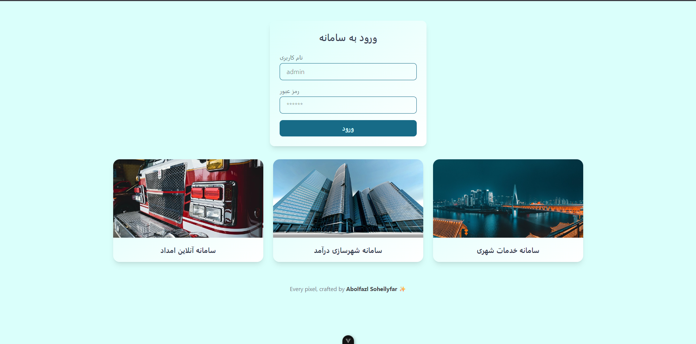
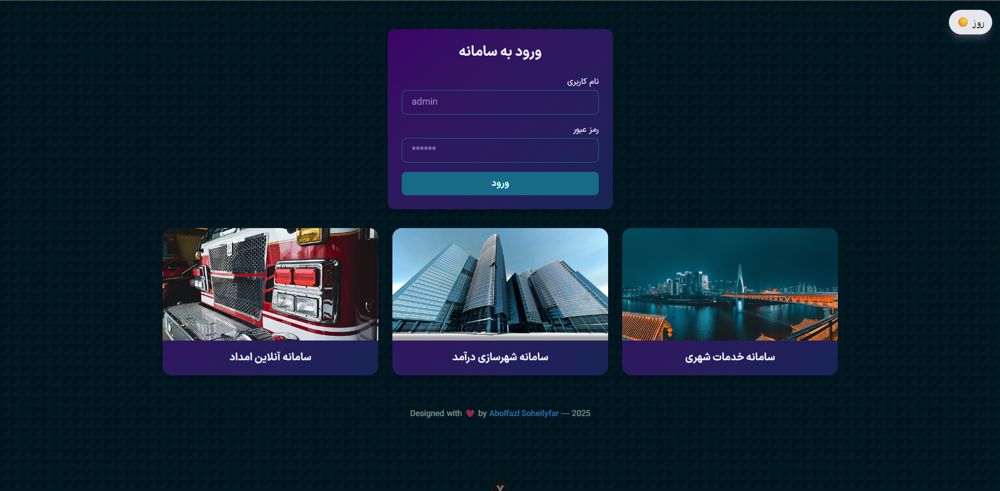

# 🌐 Vue 3 + TailwindCSS UI Project | پروژه رابط کاربری ویو + تیلویند

<p align="center">
Day Mode
  
Night Mode
  
</p>

---

## ✨ English Description

This is a simple yet interactive Vue 3 + TailwindCSS project featuring:

- Dynamic image loading using the **Pixabay API**
- Modular component structure
- Light/Dark mode toggle
- Responsive design
- Custom animated footer

> Designed with ❤️ by **Abolfazl Soheilyfar**

---

## 📚 Technologies

-Vue 3
-Vite
-Tailwind CSS
-Pixabay API

## 🇮🇷 توضیحات فارسی

این پروژه با استفاده از Vue 3 و TailwindCSS طراحی شده و امکانات زیر را دارد:

دریافت داینامیک عکس‌ها از API عمومی Pixabay

ساختار کامپوننتی ماژولار

پشتیبانی از حالت شب و روز (Dark/Light)

طراحی واکنش‌گرا (Responsive)

فوتر متحرک و زیبا

طراحی‌شده با ❤️ توسط Abolfazl Soheilyfar

## 🧪 Project Setup

```bash
npm install
npm run dev
npm run build
```
